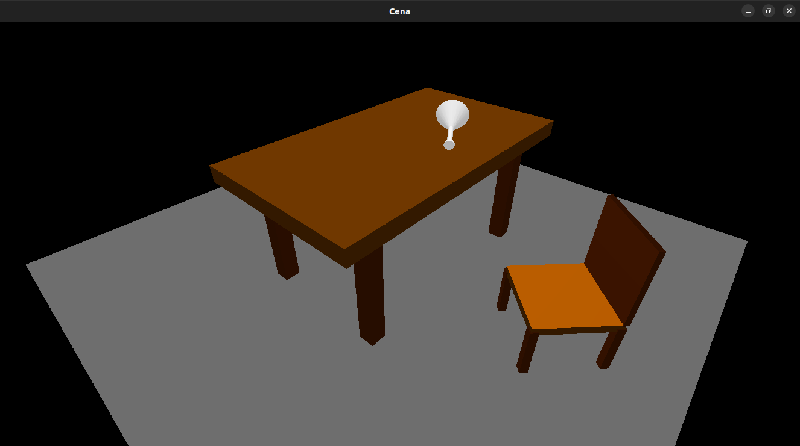

# Projeto: Construção de Cena

```c
#define AUTORES ["Gabriel de Paula"]
#define DISCIPLINA "Computação Gráfica"
#define PROFESSOR "Jesuliana Ulysses"
#define ETAPA 2
```

&nbsp;

## 🖥 Rodando o programa

Execute o Makefile para gerar os objetos de compilação e então o arquivo executável:

```bash
make
```

Execute o arquivo final:

```bash
./bin/out
```

&nbsp;

## 🖼 Prévia


